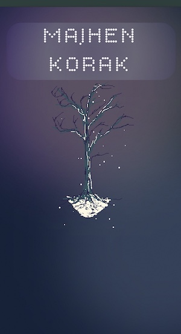

# Majhen Korak (small step)

An small Ruby on Rails application built as my first Boot.dev project. :computer: :seedling: :balloon:

So far it is a website with only three basic pages.
On them there are my attempts at learning animation.
Both pixel-art animation with sprite sheets, and SVG animations. I have drawn the assets myself and hope to continue to improve now that I understand the basic setup.
I animated with CSS and GSAP (on the first page with heavy ChatGPT usage, and then latter on less and less, and I feel I learned a lot and that I have made steps forward in understanding how to animate).

I was also learning setting up the server, getting a domain, figuring out what DNS is, using Docker and Kamal for the first time...

It lives [up here](https://www.majhenkorak.si/)

I don't recommend anyone to clone this repo, I can't quite see how it would be useful that way and I also don't understand all the ins and outs yet :blush:
